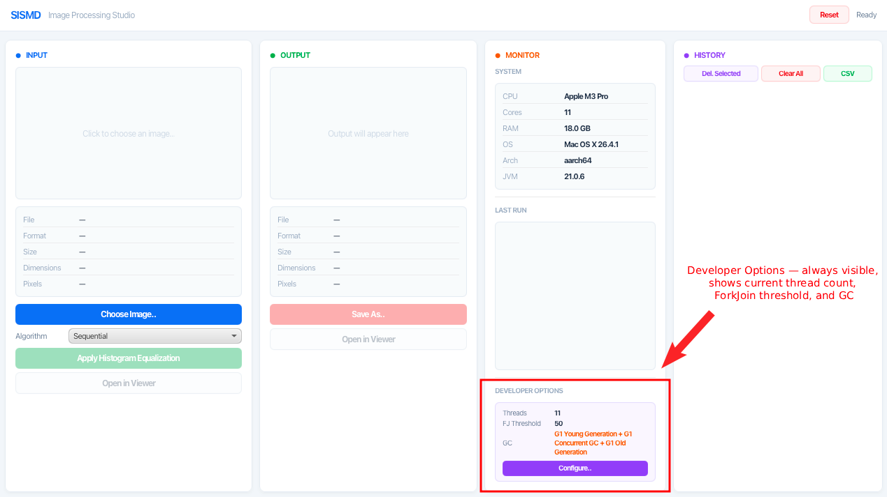
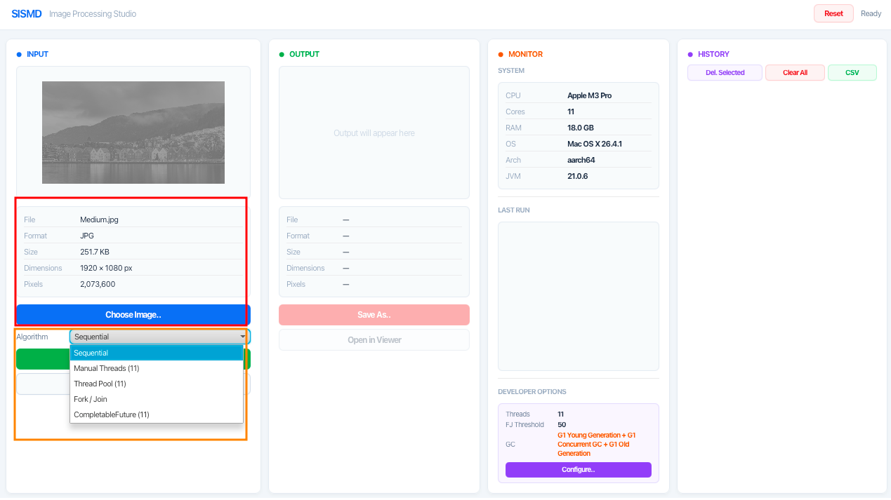
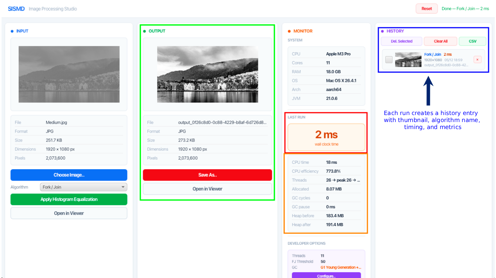
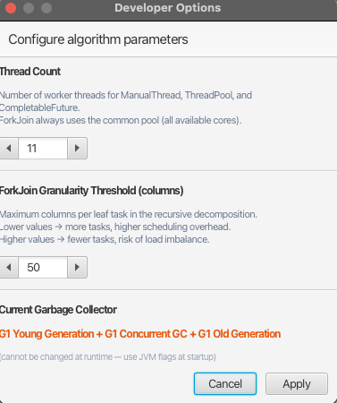

# SISMD — Histogram Equalization Parallel Processing in Java

|                      |                                                                     |
| -------------------- | ------------------------------------------------------------------- |
| **University**       | Instituto Superior de Engenharia do Porto (ISEP)                    |
| **Department**       | Departamento de Engenharia Informática (DEI)                        |
| **Subject**          | Sistemas Multinúcleo e Distribuídos (SISMD)                         |
| **Author**           | Ricardo Ribeiro Vales da Mota Freitas                               |
| **Student ID**       | 1221170                                                             |
| **Email**            | 1221170@isep.ipp.pt                                                 |
| **Date**             | May 2026                                                            |

---

## Academic Integrity Declaration

In accordance with the *Código de Boas Práticas de Conduta* of ISEP (27 October 2020),
the author declares that this project was developed with academic integrity and in
compliance with the institutional rules governing originality and ethical conduct in
higher education, as prescribed in Article 8 of the aforementioned code.

All source code, benchmark configurations, experimental analysis, and written
documentation presented in this repository were produced exclusively for the
curricular unit. Any external references, libraries, frameworks, or documentation
used throughout the development process were consulted solely as supporting technical
material and are appropriately acknowledged through repository dependencies,
official documentation references, or standard Java API usage.

The experimental results reported in this document correspond to real executions
performed on the described hardware and software environment. No benchmark values,
measurements, charts, or statistical observations were fabricated or artificially
manipulated.

---

A Java 21+ desktop application and benchmark harness for comparing five parallel
histogram equalization implementations: Sequential, Manual Threads, Thread Pool,
Fork/Join, and CompletableFuture. Includes a JavaFX GUI with live performance
monitoring, history tracking, and developer-configurable algorithm parameters.

**Course:** SISMD 2025/26 — Parallel and Distributed Systems

---

## Requirements

| Dependency     | Minimum Version | Install (macOS)           |
| -------------- | --------------- | ------------------------- |
| Java (JDK)     | 21              | `brew install openjdk@21` |
| Apache Maven   | 3.9+            | `brew install maven`      |
| JavaFX         | 21.0.2          | bundled via Maven         |
| XChart         | 3.8.8           | bundled via Maven         |
| Graphviz (dot) | any             | `brew install graphviz`   |

**Optional** (only needed to regenerate PlantUML diagrams from source):
| Dependency | Install (macOS) |
| ---------------- | -------------------------------------- |
| PlantUML | `brew install plantuml` |

Verify your installation:

```bash
java --version     # should print 21.x.x
mvn --version      # should print 3.9+
```

---

## Quick Start

```bash
# 1. Clone and enter the project
git clone <repo-url> sismd-project
cd sismd-project

# 2. Build the project
make build

# 3. Launch the GUI
make run

# 4. Run the full benchmark suite (all 4 GCs, ~5 minutes)
make benchmark-gc
```

---

## Project Structure

```
sismd-project/
├── src/main/java/com/sismd/
│   ├── App.java                          # JavaFX entry point
│   ├── service/
│   │   ├── ImageProcessingService.java   # @FunctionalInterface
│   │   └── impl/
│   │       ├── SequentialImageProcessingService.java
│   │       ├── ManualThreadImageProcessingService.java
│   │       ├── ThreadPoolImageProcessingService.java
│   │       ├── ForkJoinImageProcessingService.java
│   │       ├── CompletableFutureImageProcessingService.java
│   │       └── HistogramUtils.java       # shared pure functions
│   ├── model/
│   │   ├── ImageData.java                # packed-int column-major pixels
│   │   ├── ImageMetadata.java
│   │   ├── GenerationRecord.java         # UI history persistence
│   │   ├── BenchmarkResult.java          # CLI benchmark row
│   │   └── BenchmarkSummary.java         # CLI summary report
│   ├── benchmark/
│   │   ├── BenchmarkRunner.java          # main() for CLI benchmarks
│   │   ├── BenchmarkCharts.java          # XChart PNG generation
│   │   └── BenchmarkImageLoader.java     # loads pre-scaled images
│   ├── monitor/
│   │   ├── performance/                  # JMX performance adapter
│   │   └── system/                       # system info detection
│   ├── repository/
│   │   ├── CsvExporter.java              # history → CSV export
│   │   ├── FileGenerationRepository.java # serialized history store
│   │   └── GenerationRepository.java     # interface
│   └── ui/
│       ├── MainController.java           # JavaFX controller
│       └── DeveloperOptionsDialog.java   # dev settings modal
├── src/main/resources/com/sismd/
│   └── main.fxml                         # JavaFX layout
├── images/benchmark/                     # pre-scaled input images
│   ├── Small.jpg       (640×360)
│   ├── Medium.jpg      (1920×1080)
│   ├── Large.jpg       (4096×2304)
│   └── Original.jpg    (8192×4608)
├── results/                              # benchmark output
├── diagrams/                             # PlantUML SVG diagrams
├── REPORT.md                             # full performance analysis
├── Makefile
├── pom.xml
├── benchmark-gc.sh
└── README.md
```

---

## Makefile Commands

| Command             | Description                                             |
| ------------------- | ------------------------------------------------------- |
| `make build`        | Compile the project (`mvn compile`)                     |
| `make run`          | Build + launch the JavaFX GUI                           |
| `make test`         | Run JUnit 5 correctness tests (5 impls × 5 image types) |
| `make benchmark`    | Run CLI benchmark (ParallelGC only, ~1 min)             |
| `make benchmark-gc` | Run full GC tuning benchmark (4 collectors, ~5 min)     |
| `make clean`        | Delete `target/` build output                           |

---

## UI Usage Guide

### Launching the Application

```bash
make run
```



---

### Step 1 — Choose an Image

Click the **"Choose Image…"** button (blue) in the left INPUT panel, or click the image preview area. Select any JPEG, PNG, BMP, or GIF file.

After selection the INPUT panel populates with:

- File name, format, file size
- Image dimensions and pixel count
- A thumbnail preview



---

### Step 2 — Select an Algorithm

Use the **Algorithm** dropdown in the INPUT panel to choose one of five strategies:

| Algorithm             | Description                              |
| --------------------- | ---------------------------------------- |
| Sequential            | Single-threaded baseline                 |
| Manual Threads (N)    | Fresh `Thread` objects per invocation    |
| Thread Pool (N)       | `Executors.newFixedThreadPool`           |
| Fork / Join           | Recursive divide-and-conquer             |
| CompletableFuture (N) | Asynchronous pipeline with `supplyAsync` |

The number `(N)` reflects the current thread count configured in Developer Options.

---

### Step 3 — Process the Image

Click **"Apply Histogram Equalization"** (green button). The application runs the
selected algorithm in a background thread and measures wall-clock time, CPU time,
memory allocation, heap usage, and GC activity via JMX.

After processing the OUTPUT panel shows:

- The equalized grayscale image
- Output metadata (dimensions, pixel count, file size)
- The wall-clock time card (orange, large number in milliseconds)
- Full performance metrics (CPU time, CPU efficiency, allocated memory, heap delta, GC cycles, GC pause, peak threads, GC collector)



---

### Step 4 — Save or Open the Result

- **"Save As…"** (red button) — exports the equalized image to a file
- **"Open in Viewer"** — opens the output image in the OS default image viewer
- Click the **output preview area** to open in viewer

---

### Step 5 — History Panel

The rightmost HISTORY panel persists all processing runs across sessions
(serialized to `uploads/history.dat`).

- **Click any history row** to reload that run's input, output, metrics, and algorithm selection
- **Checkboxes** on each row allow multi-select for batch deletion
- **"Del. Selected"** deletes checked rows only
- **"Clear All"** removes all history
- **"CSV"** (green) exports the entire history to a CSV file compatible with spreadsheet analysis
- **"✕"** button on each row deletes that single entry

---

### Step 6 — Developer Options

The **DEVELOPER OPTIONS** panel at the bottom of the Monitor column always
displays the current configuration:

| Field        | Description                                             |
| ------------ | ------------------------------------------------------- |
| Threads      | Workers for ManualThread, ThreadPool, CompletableFuture |
| FJ Threshold | ForkJoin granularity (columns per leaf task)            |
| GC           | Current garbage collector (read-only, set at startup)   |

Click **"Configure…"** to open the settings modal:

1. Adjust **Thread Count** (1–64) and **ForkJoin Threshold** (1–2000)
2. Click **Apply** — the implementation registry rebuilds and the dropdown labels update
3. The currently selected algorithm is preserved



---

## Benchmark Reference

The full performance analysis report is at **[REPORT.md](REPORT.md)** (690 lines).
It covers:

- Methodology (hardware, JVM, image sizes, measurement protocol)
- Implementation details with code snippets and PlantUML diagrams
- Benchmark results: 27 figures, 6 tables across 4 GC collectors
- Analysis: Amdahl's law, memory-bandwidth saturation, ForkJoin threshold sensitivity
- Conclusions: ForkJoin(th=50) + ParallelGC is the recommended configuration

### Running Benchmarks

```bash
# Quick benchmark (ParallelGC only, ~1 minute)
make benchmark

# Full GC tuning benchmark (all 4 collectors, ~5 minutes)
make benchmark-gc
```

Benchmark output is written to `results/`:

```
results/
├── benchmark.csv            # all configurations, one row per run
├── summary.txt              # human-readable highlights
├── walltime_overview.png    # best time per impl across all sizes
├── speedup_overview.png     # best speedup per impl across all sizes
├── walltime_Small.png       # per-size wall-time charts
├── walltime_Medium.png
├── walltime_Large.png
├── walltime_Original.png
├── speedup_Small.png        # per-size speedup charts
├── speedup_Medium.png
├── speedup_Large.png
├── speedup_Original.png
├── cpu_time.png             # CPU time bar chart
├── cpu_efficiency.png       # CPU efficiency bar chart
├── allocated.png            # allocated memory bar chart
├── heap_delta.png           # heap delta bar chart
├── gc_pause.png             # GC pause bar chart
└── gc_tuning/
    ├── G1GC/                # same set of CSV + PNGs for G1GC
    ├── ParallelGC/          # same set for ParallelGC
    ├── SerialGC/            # same set for SerialGC
    └── ZGC/                 # same set for ZGC
```

### Customising Benchmark Parameters

Edit `BenchmarkRunner.java` (lines ~90–130) to change:

```java
// Thread counts tested
private static final int[] THREAD_COUNTS = { 1, 2, 4, 8, 11, 16 };

// ForkJoin thresholds tested
private static final int[] FORK_JOIN_THRESHOLDS = { 10, 50, 200 };

// Warmup and measured iterations
private static final int WARMUP_RUNS = 3;
private static final int MEASURED_RUNS = 10;
```

Edit `benchmark-gc.sh` to change JVM flags:

```bash
GC_NAMES=(  "G1GC"          "ZGC"          "SerialGC"          "ParallelGC"          )
GC_FLAGS=(  "-XX:+UseG1GC"  "-XX:+UseZGC"  "-XX:+UseSerialGC"  "-XX:+UseParallelGC"  )
```

---

## Changing GC at Runtime

The garbage collector cannot be changed after the JVM starts. To use a different
collector, set the `MAVEN_OPTS` or `_JAVA_OPTIONS` environment variable before
launching:

```bash
# Use G1GC with a 200ms pause target
MAVEN_OPTS="-XX:+UseG1GC -XX:MaxGCPauseMillis=200 -Xmx4g" make run

# Use ZGC (ultra-low pause)
MAVEN_OPTS="-XX:+UseZGC -Xmx4g" make run

# Use SerialGC
MAVEN_OPTS="-XX:+UseSerialGC -Xmx4g" make run

# Use ParallelGC (default, throughput-optimized)
MAVEN_OPTS="-XX:+UseParallelGC -Xmx4g" make run
```

---

## Correctness Tests

```bash
make test
```

Runs `HistogramEqualizationCorrectnessTest` which verifies that all 5
implementations produce **pixel-identical** output to the Sequential baseline
across 5 image types (small, medium, large, gradient, uniform). Uses JUnit 5
parameterized tests with `@MethodSource`.

---

## Diagrams

PlantUML source files are in `diagrams/`. To regenerate the SVGs:

```bash
java -jar plantuml.jar -tsvg diagrams/*.puml
```

Generated diagrams:

- `algorithm_stages.svg` — three-stage algorithm activity diagram
- `class_hierarchy.svg` — UML class diagram of all implementations
- `forkjoin_tree.svg` — recursive decomposition tree for ForkJoin

---

## Tech Stack

| Component             | Technology                       |
| --------------------- | -------------------------------- |
| Language              | Java 21                          |
| Build                 | Maven 3.9+                       |
| GUI                   | JavaFX 21 (OpenJFX)              |
| Charts                | XChart 3.8.8                     |
| Diagrams              | PlantUML + Graphviz              |
| Boilerplate reduction | Lombok 1.18.34                   |
| Testing               | JUnit 5.11 + AssertJ 3.26        |
| Monitoring            | JMX (com.sun.management beans)   |
| OS tested             | macOS 15 (aarch64, Apple M3 Pro) |

---

## License

Academic project — SISMD 2025/26.
